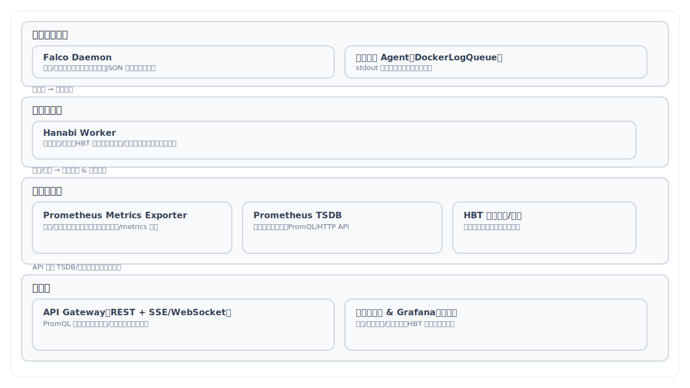

# Falco Prometheus Stack

一个基于 Falco 的安全监控系统，集成 Prometheus、和自定义 Python 分析工具，用于实时监控和分析容器安全事件。

## 📋 项目简介

本项目提供了一套完整的容器安全监控解决方案：

- **Falco**: 云原生运行时安全工具，实时检测异常行为和威胁
- **Prometheus**: 时序数据库，存储和查询安全事件指标
- **Hanabi**: 自定义 Python 工具，实时读取和分析 Falco 日志流

## 🏗️ 架构

```
┌─────────────┐
│   Falco     │ 监控系统调用和容器事件
└──────┬──────┘
       │ JSON logs
       ↓
┌─────────────┐
│DockerLogQueue│ Python 实时日志流处理
└─────────────┘
       │ Metrics
       ↓
┌─────────────┐
│ Prometheus  │ 指标存储和查询
└─────────────┘
```

架构分层图（SVG）：



## 📚 文档导航

- 架构分层图：`docs/architecture-4layer.svg`
- 系统架构说明：`docs/system-architecture.md`
- 技术栈（最终版）：`docs/tech-stack.md`
- 后端接口契约：`docs/backend-api-contract.md`、`docs/interfaces/openapi.yaml`
- 前端初始化指导：`docs/frontend-setup.md`
- SSE 事件封装：`docs/sse-envelope.md`
- PromQL 模板与标签治理：`docs/promql-templates.md`
- 测试计划：`docs/test-plan.md`
- 开发路线图：`docs/roadmap.md`
- Issue 标签规范：`docs/issue-labels.md`

## 🚀 快速开始

### 前置要求

- Docker 和 Docker Compose
- Python 3.14+
- Linux 内核（用于 Falco 驱动）

### 安装步骤

1. **克隆仓库**
```bash
git clone <repository-url>
cd falco-prometheus-stack
```

2. **安装 Python 依赖**
```bash
# 使用 uv（推荐）
uv sync


## 📖 使用方法

### 使用 DockerLogQueue 实时读取 Falco 日志

```python
from hanabi.utils.queue import DockerLogQueue
import json

# 创建日志队列
log_queue = DockerLogQueue(container_name="falco", max_queue_size=10000)

try:
    # 启动日志流
    log_queue.start()
    
    # 持续读取日志
    while True:
        json_obj = log_queue.get(timeout=1)
        if json_obj:
            print(json.dumps(json_obj, ensure_ascii=False))
            # 在这里添加你的业务逻辑
            
except KeyboardInterrupt:
    print("\n停止监控")
finally:
    log_queue.stop()
```

### 运行示例程序

```bash
python main.py
```

### 查看 Prometheus 指标

访问 `http://localhost:9090` 打开 Prometheus Web UI，查询安全事件指标。

示例查询：
- 日志总数：`sum(rate(syscall_s_total[5m]))`
- 按优先级：`sum by(priority) (rate(syscall_s_total[5m]))`
- 最新日志时间：`syscall_last__timestamp_seconds`
- 分类维度（rule_category）：`sum by(rule_category) (rate(syscall_s_total[5m]))`

### Docker 一键系统操作指引

#### 启动与构建
- 初始化并启动全部服务（后端、前端、Falco、Exporter、Prometheus、Grafana）：
```bash
docker compose up -d --build
```
- 查看服务状态：
```bash
docker compose ps
```

#### 服务入口
- `API`：`http://<服务器IP>:18000`（后端 REST + 文档 `/docs`）
- `Web`：`http://<服务器IP>:8081`（前端控制台，已反向代理 `/api` 到后端）
- `Prometheus`：`http://<服务器IP>:9090`（查询指标）
- `Grafana`：`http://<服务器IP>:3000`（默认账户 `admin/admin`）

#### 常用运维命令
- 重启单个服务：
```bash
docker compose restart api
docker compose restart hanabi_worker
docker compose restart exporter
docker compose restart falco
docker compose restart prometheus
docker compose restart web
```
- 查看实时日志：
```bash
docker compose logs -f hanabi_worker
docker compose logs -f exporter
docker compose logs -f api
```
- 停止并移除：
```bash
docker compose down
# 如需清理数据卷（慎用）
docker compose down -v
```

#### 关键环境变量（已在 compose 配置）
- `FALCO_CONTAINER=falco`（Exporter/Worker 读取 Falco 日志的容器名）
- `HBT_STORAGE_PATH=/app/data/hbt`（Hanabi 画像快照目录）
- `DATA_DIR=/app/data`（SQLite 明细数据库目录，文件为 `/app/data/logs.db`）
- `PROMETHEUS_URL=http://prometheus:9090`（API 查询 Prometheus 的地址）
- `LOG_STORAGE_DEBUG=1`（可选，开启日志入库调试输出）

#### 快速自检流程
- Falco：`docker compose logs -f falco` 应持续输出 JSON 行事件
- Exporter：`curl http://<服务器IP>:9876/metrics | head` 能看到 `syscall_s_total` 等指标
- Prometheus：在 Web UI 查询
  - `sum(rate(syscall_s_total[5m]))` 与 `syscall_last__timestamp_seconds` 有结果
- API：
  - `curl http://<服务器IP>:18000/api/containers` 返回容器列表
  - `curl http://<服务器IP>:18000/api/containers/<id>/logs` 返回该容器的历史明细
- Web：打开 `http://<服务器IP>:8081`，总览与日志页面应正常显示

#### 问题定位提示
- 容器列表为空：检查 Prometheus 是否抓取到 Exporter（`prometheus.yml` 目标应为 `exporter:9876`）
- 日志页为空：确认 `hanabi_worker` 正在写入 `/app/data/logs.db`，API 与 Web 挂载了共享卷 `shared_data`
- 仅新日志可见：队列默认只拉取启动后的新事件（如需历史，需调整采集策略或输出通道）

## 🔧 核心组件

### DockerLogQueue

一个线程安全的队列类，用于从 Docker 容器的 stdout 实时读取 JSON 日志流。

**特性**：
- ✅ 后台线程异步采集日志
- ✅ 自动 JSON 解析和验证
- ✅ 线程安全的队列操作
- ✅ 可配置的队列大小（防止内存溢出）
- ✅ 统计信息（处理行数、错误数）
- ✅ 优雅的启动和停止机制
- ✅ 只读取实时日志（从 `start()` 之后的新日志）

**API**：
```python
# 初始化
queue = DockerLogQueue(container_name="falco", max_queue_size=10000)

# 启动采集
queue.start()

# 获取日志（阻塞式，带超时）
json_obj = queue.get(timeout=1)

# 获取日志（非阻塞式）
json_obj = queue.get_nowait()

# 检查队列状态
is_empty = queue.is_empty()
size = queue.size()

# 获取统计信息
stats = queue.get_stats()

# 停止采集
queue.stop()
```

## 🛠️ 配置

### Falco 配置

编辑 `falco/falco.yaml` 自定义 Falco 行为：
- `json_output: true` - 启用 JSON 格式输出
- `json_include_output_property: true` - 包含完整输出字段
- 自定义规则：在 `falco/rules/custom_rules.yaml` 中添加


### Prometheus 配置

编辑 `prometheus/prometheus.yml` 配置抓取目标和规则。

## 📊 监控示例

### Falco 事件类型统计

```promql
sum by(priority) (rate(falco_s_total[5m]))
```

### 检测到的威胁数量

```promql
increase(falco_s_total{priority="Critical"}[1h])
```
